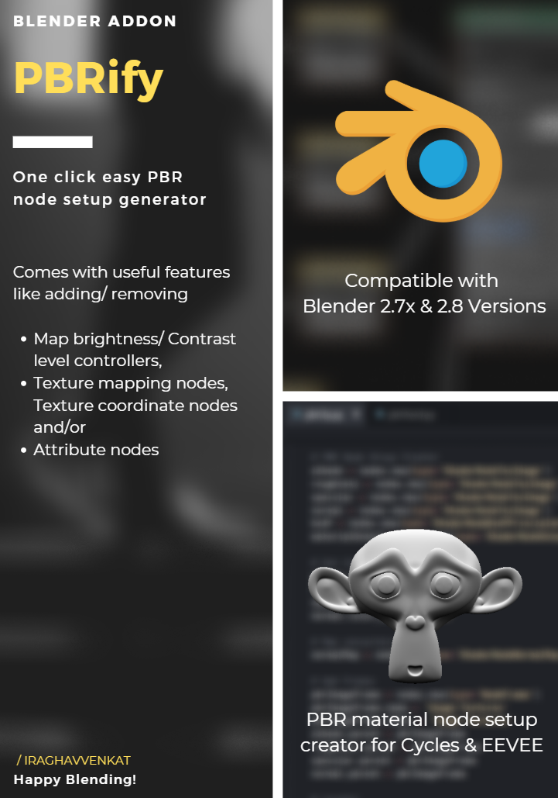

# PBRify

One click PBR node setup generator for Blender Cycles Engine.

&nbsp;&nbsp;&nbsp;&nbsp;&nbsp;&nbsp;&nbsp;&nbsp;&nbsp;&nbsp;&nbsp;&nbsp;&nbsp;&nbsp;&nbsp;&nbsp;&nbsp;&nbsp;

## How to install this addon?

You can install this addon using any of the following 2 methods:
 
**Method 1**  
    - Goto Edit > Preferences  
    - Switch to Addons Tab and Click on Install from File button   
    - Navigate to this addon and select pbrify.py file  
    - Enable the addon by checking it on the addons list  
(or)   
**Method 2**  
    - Download the pbrify.py file and move it to blender 2.x > Scripts > Addons Folder  
*(That's all! Now just select a mesh goto properties > Materials > There you will find the PBRify Panel)*
